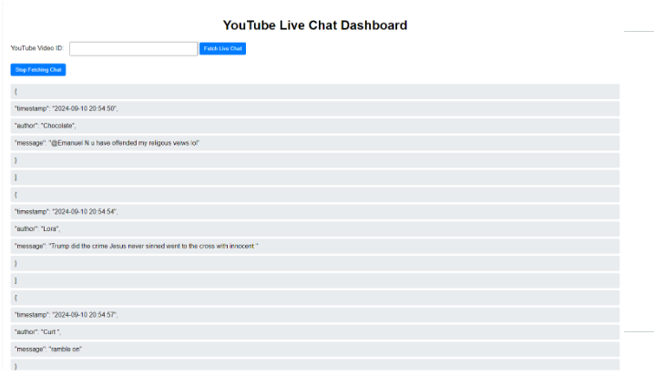

# Uncovering Political Discourse: A Data-Driven Analysis of Political Debates

## Introduction

In today’s world, political debates are more than just a contest of words—they’re a chance for millions of people to share their thoughts, opinions, and passions. But how can we truly understand what the audience is thinking as these high-stakes moments unfold? That's where **data** comes in.

Imagine being able to track every comment, every reaction, and every shift in mood during a presidential debate. From the intense exchanges to the quieter moments, what are people saying, and how are they feeling? This project set out to answer those questions by collecting and analyzing live chat messages and comments from major political debates.

I focused on the **2020 and 2024 presidential debates**, as well as the **2024 vice-presidential debate**, to uncover patterns in how people engage with candidates, which topics drive the strongest reactions, and how debates influence public opinion. By analyzing this data, we can better understand the audience’s mood, the issues that matter most to them, and how their sentiments evolve over the course of the debates.

Along the way, I also came across an interesting study on **cross-partisan engagement** in online discussions. The research found that conservative users are more likely to engage with left-leaning content than liberals are with right-leaning content. While this didn’t directly impact my analysis, it offered valuable context for understanding how different political groups interact during live debates.

In this project, you’ll see how raw data was transformed into meaningful insights, helping to make sense of the sometimes chaotic flow of online conversation. Ready to explore how the public reacts to a debate in real time?

## Data Collection: What Data and Why?

### What Data Was Collected?

The goal of this project was to capture data from four major political debates: three presidential and one vice-presidential. I collected live chat messages and comments from YouTube, where the debates were live-streamed, using data from various news networks. Here are the four debates that provided the data:

1. **First Presidential Debate (2020, between Joe Biden & Donald Trump)** – comments
2. **Second Presidential Debate (2024, between Joe Biden & Donald Trump)** – comments
3. **Third Presidential Debate (2024, between Kamala Harris & Donald Trump)** – livechats & comments
4. **Vice-Presidential Debate (2024, between Tim Walz and JD Vance)** – livechats & comments

  
   
  <em>Overview of the dataset</em>

### Why This Data?

The goal was to analyze how different groups engaged with the candidates, focusing on public sentiment and partisan shifts over the debates. Livechat data from Debates 3 and 4 provided real-time reactions, while comments from Debates 1 and 2 offered context for evolving engagement. The vice-presidential debate data helped compare audience reactions in less publicized, yet important debates.

## How Was the Data Collected?

Collecting data for this project required a few different strategies depending on the debate and the type of data. Here’s how it worked:

### For Debate 1 and 2 (2020 and 2024 Presidential Debates)

#### Initial Collection:
The data for these debates, featuring Joe Biden and Donald Trump, was first collected in CSV format. It included basic details like the text of the comments, the number of likes, and timestamps.

#### Conversion Problems:
When trying to convert this CSV data into JSON format (which is more flexible and easier to use for merging datasets), things didn’t go smoothly. The conversion process caused errors—some attributes didn’t match correctly, which made the data incomplete and inaccurate.

#### Fixing the Issues with Re-scraping:
To solve the problem, I went back and scraped the data again—this time directly in JSON format. This ensured the data was clean, accurate, and could easily be combined with the datasets from Debates 3 and 4, which were already collected in JSON format.

### For Debates 3 and 4:

#### Livechat Data Collection:
For the Third Presidential Debate and the Vice-Presidential Debate (2024), I used a Python tool called **pytchat**, which is designed to automatically pull live chat messages from YouTube. This tool made it easy to collect live chat messages, timestamps, and other useful details directly from the YouTube streams as the debates were happening.

#### Manual Script for Debate 3:
For Debate 3 (2024), I manually ran the script during and after the debate to capture live chat data in real time. The **pytchat** library helped collect over 30,000 comments, focusing on sentiment and engagement during key moments.

#### Automated Script for Debate 4 on Hipergator:
For Debate 4 (2024), I automated the scraping process using Hipergator, the University of Florida’s high-performance system. The script ran continuously, collecting data from multiple sources (NBC, WFLA, CNN TV18) and saving it in JSON format for consistency.

<!-- 

*Dashboard of live chat messages scraper* -->

  
   
  <em>Dashboard of live chat messages scraper</em>

## Challenges and Adjustments

#### Scraping Frequency:
Scraping live chat data required constant monitoring, especially during key moments of the debates. With so many comments coming in quickly, the scripts needed to be fast and efficient to capture everything in real time.

#### Data Integrity:
Ensuring consistency across different data sources and formats was a challenge. I had to re-scrape data from the 2020 and 2024 presidential debates to ensure the formats matched and the information was accurate.

## Key Data Collected:

The data collection efforts yielded the following key datasets for each debate:

| Debate                         | Data Type              | Source                                                                                                      |
|---------------------------------|------------------------|-------------------------------------------------------------------------------------------------------------|
| **First Presidential Debate (2020)** | YouTube Comments       | CBS, NBC, C-SPAN, Fox News, Sky News                                                                        |
| **Second Presidential Debate (2024)** | YouTube Comments       | MSNBC, NBC, C-SPAN, USA Today, Wall Street Journal                                                          |
| **Third Presidential Debate (2024)** | YouTube Comments & Livechats | **Livechats Source:** Newsmax, NBC, CNN News18, WFAA, Fox News, Brian Tyler Cohen’s YouTube Channel **Comments Source:** CBS, CNN News18, C-SPAN, MSNBC, NBC, Newsmax, Washington Post |
| **Vice-Presidential Debate (2024)** | YouTube Comments & Livechats | **Livechats Source:** CNBC TV18, CNN TV18, David Pakman Show, Face the Nation, Kamala Harris’s YouTube Channel, NBC, Tim Walz’s YouTube Channel, WFAA, WFLA **Comments Source:** NBC, CBS, WFLA, WFAA, CNBC TV18 |

## Initial Analysis of Livechat Data: Key Findings from the Debate

### Debate Number 3: 2024 Presidential Debate between Kamala Harris and Donald Trump

For this debate, the initial analysis of the livechat data revealed several noteworthy findings:

#### Audience Engagement:
Comments spiked during key moments, especially when Kamala Harris challenged Donald Trump on policy and personal conduct. These exchanges sparked significant reactions, with data from sources like Newsmax, NBC, CNN News18, and Brian Tyler Cohen showing clear increases in engagement.

| **Source**                  | **Number of Livechats** | **Number of Unique Authors** |
|-----------------------------|-------------------------|------------------------------|
| **Newsmax**                 | 30,481                  | 4,171                        |
| **CNN News18**              | 1,310                   | 82                           |
| **NBC**                     | 36                      | 1                            |
| **Brian Tyler Cohen (Live Reaction)** | 3,702              | 1,316                        |

#### Sentiment Shifts: 
The comments revealed a divided audience. Supporters of both Harris and Trump voiced strong opinions, especially on economic issues. As the debate heated up over topics like immigration and taxes, negative comments dominated, highlighting the tension between the two sides.

### Debate Number 4: 2024 Vice-Presidential Debate between Tim Walz and JD Vance

For the 4th debate, the comments revealed a different dynamic:

#### Engagement Levels:
The number of comments in the vice-presidential debate was much lower than in the presidential debates. However, the discussion was still engaging, particularly when Tim Walz and JD Vance debated important topics like healthcare, climate change, and rural development.
 
Data from the various news networks for this debate include:

| **Source**                    | **Number of Livechats** | **Number of Unique Authors** |
|-------------------------------|-------------------------|------------------------------|
| **Newsmax**                   | 30,481                  | 4,171                        |
| **CNN News18**                | 1,310                   | 82                           |
| **NBC**                       | 36                      | 1                            |
| **Brian Tyler Cohen (Live Reaction)** | 3,702            | 1,316                        |

#### Comment Density Over Time:
As expected, the comment volume spiked when hot topics like climate change and economic reform were brought up. But these spikes were smaller compared to the presidential debates, showing that the overall engagement was lower.

#### Supportive vs. Critical Comments:
The reactions in the vice-presidential debate were more neutral and focused on the issues. The conversation was less personal and more about policies. Comments from Vance's supporters mostly revolved around his economic policies, while Walz's supporters discussed healthcare and social issues more.

#### Toxicity Levels:
The tone of the comments was much less toxic than in the presidential debates. This shows that the debate didn’t stir up as much emotional or confrontational reactions from the audience.

## Key Insights from the Initial Analysis

### Audience Engagement Patterns:
Both the presidential and vice-presidential debates saw big jumps in engagement at key moments, especially when the candidates discussed controversial or hot-button topics. The more divisive the issue, the more comments and reactions came in from viewers.

### Sentiment Polarization:
The 2024 presidential debate between Harris and Trump showed a high level of polarization in how people felt. Supporters of both candidates reacted strongly, often with negative comments toward the other side. This created a sharp divide in the tone of the conversation.

### Lower Engagement in Vice-Presidential Debate:
The vice-presidential debate had fewer comments overall, which is typical since vice-presidential candidates usually get less attention than the presidential ones. However, this debate was more focused on specific issues, with less offensive or personal attacks in the comments.

### Toxicity Levels:
The toxicity of comments was much higher in the presidential debates, especially when candidates made personal attacks or debated controversial topics. On the other hand, the vice-presidential debate had a much calmer tone, with fewer heated or toxic comments.

## Data Engineering: Integrating and Organizing Diverse Data Sources

A key challenge in this project was managing and restructuring the large volume of data collected from multiple debates, each with different formats and structures.

#### Challenges of Data Collection and Format Inconsistencies
The data came from multiple sources, each in a different format—CSV for Debates 1 and 2, and JSON for Debates 3 and 4. This made merging and analyzing the data difficult.

#### Consolidating Data into a Uniform Format
The data from Debates 1 and 2 was in CSV format with only 5 attributes, while the livechat data from Debates 3 and 4 was in JSON format but had fewer attributes. I converted the CSV data to JSON to ensure compatibility and standardization.

#### Attribute Standardization
Different debates and sources used different attribute names. For example, the CSV files used `published_at`, but the JSON files used `publishedAt`. I mapped and standardized these attributes, renaming fields like `message` to `text` and adding new attributes to enrich the data for analysis.

### Creating a Unified Dataset: Merging Data from Four Debates

After standardizing the data, I combined the datasets from the 2020 and 2024 presidential debates and the 2024 vice-presidential debate into one unified dataset for easier analysis.

#### Adding Custom Attributes:

- **Source**: This shows which news network or YouTube channel the comment came from (e.g., Newsmax, NBC). It helps track how different platforms might influence audience sentiment.
  
- **Collector**: This identifies who collected the data (e.g., Akash & Deeptika or Priyanshu), useful for tracking who worked on which parts of the data.
  
- **Type**: Differentiates between live chat data and regular comments, making it easier to handle the varying levels of detail in each.
  
- **Debate Type**: This attribute marks whether the data comes from a presidential ('P') or vice-presidential ('VP') debate, helping to organize the data for further analysis.

This added another layer of organization, allowing me to segment the data based on the type of debate, making comparisons easier.

### Addressing Data Inconsistencies During Merging

While merging data from multiple debates, I faced challenges with missing values and incompatible data. Here’s how I handled them:

#### Handling Missing Values:
Some data, especially from the 2020 presidential debate, was incomplete (e.g., missing "isPublic" value). I filled these gaps with "null" to maintain consistency.

#### Resolving Attribute Mismatches:
I added a "debate type" attribute to the CSV files to clearly label whether data was from a presidential or vice-presidential debate, ensuring proper organization.

#### Data Duplication:
To remove duplicate comments or live chats, I used unique identifiers and timestamps, ensuring the dataset remained clean and accurate.

### Changing ‘debate_type’ to ‘debate_number’ for Better Classification

After reviewing the dataset, I realized that the 'debate_type' attribute (which only marked whether a debate was presidential or vice-presidential) wasn’t enough for clear classification. Since there were three presidential debates in the 2024 election, simply labeling them as "P" for presidential and "VP" for vice-presidential made it hard to distinguish between the different presidential debates.

To make things clearer, I decided to replace the 'debate_type' attribute with a new one called 'debate_number'. This new attribute allowed for a more specific classification of the four debates we were analyzing. Here's how the 'debate_number' works:

- **1**: First Presidential Debate (2020, between Joe Biden & Donald Trump)
- **2**: Second Presidential Debate (2024, between Joe Biden & Donald Trump)
- **3**: Third Presidential Debate (2024, between Kamala Harris & Donald Trump)
- **4**: Vice-Presidential Debate (2024, between Tim Walz and JD Vance)

This change made it much easier to differentiate between the debates and reference them accurately throughout the analysis. It helped simplify the dataset and allowed for clearer comparisons, especially between the three 2024 presidential debates.

### Building the Final Dataset for Analysis

Once all datasets were standardized, merged, and cleaned, I had a unified dataset that combined all the data from the four debates. The dataset included 13 key attributes:

- **author**: The author of the comment or livechat.
- **authorChannelUrl**: The URL of the author's YouTube channel.
- **authorProfileImageUrl**: The URL of the author's profile picture on their YouTube channel.
- **text**: The content of the comment or livechat message.
- **likeCount**: The number of likes the comment received.
- **publishedAt**: The timestamp when the comment was posted.
- **updatedAt**: The timestamp when the comment was last updated.
- **canRate**: Whether the comment can be rated.
- **isPublic**: Whether the comment is public.
- **source**: The news network or YouTube channel where the comment was posted.
- **collector**: The name(s) of the team member(s) who collected the data.
- **type**: Whether the data is a comment or a livechat message.
- **debate_number**: The debate number (1, 2, 3, or 4) to classify the debates more effectively.

  
   
  <em>Sample comment from Debate 4 - 'WFAA' news network</em>

## Data Cleaning and Pipeline Setup

When working with large amounts of data, especially from comments and live chats, it’s crucial to clean it up for accuracy and usefulness. I built a data cleaning pipeline using Snorkel and scikit-learn to automate this process, making the data easier to analyze.

### Cleaning the Data

- **Text Cleaning**: I removed unnecessary characters like symbols and emojis, converted text to lowercase, and filtered out irrelevant content like spam.
  
- **Handling Outliers**: I used the Interquartile Range (IQR) method to remove extreme data points, ensuring the analysis wasn’t skewed by unusual values.
  
- **Extracting Meaningful Information**: After cleaning, I focused on extracting useful insights, such as sentiment scores, engagement metrics (likes, shares), and the topics discussed in the comments (e.g., healthcare, economy).

This process helped ensure the data was organized and ready for deeper analysis.

## Building an Interactive Dashboard for the Merged Data

I built an interactive dashboard to make the data more accessible and easier to explore. Users can search and filter through merged data, dive into key trends, and access detailed comments and live chat messages from the debates in real time.

### Key Features Include:

- **Search Functionality**: Search comments by keywords, candidates, or topics.
- **Filtering Options**: Sort data by debate, sentiment, or comment source (e.g., Newsmax, NBC).
- **Detailed Views**: View individual comments or live chats to understand reactions during key moments.

The dashboard turns complex data into an easy-to-use tool for both researchers and casual users to explore political discourse in real time.

## Conclusion & Future Work

This project explored audience engagement during political debates by analyzing live chat and comment data from the **2020 and 2024 presidential debates** and the **2024 vice-presidential debate**. By cleaning and merging data from multiple sources, we uncovered patterns in audience sentiment and reactions, highlighting key moments of engagement.

With the help of custom attributes and an interactive dashboard, we gained valuable insights into how debates influence public opinion. Moving forward, the project can be expanded to include more debates, deeper sentiment analysis, and further exploration of cross-partisan engagement. Additionally, future work will focus on **enhancing the dashboard** to offer more advanced features, such as real-time data tracking and more interactive visualizations, providing deeper insights into political discourse in the digital age.

